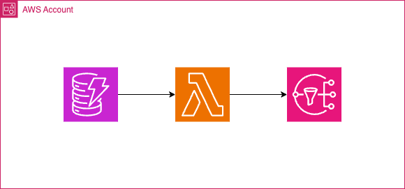

# Email Subscription Service

This service subscribes email addresses to a newsletter.

Flow of Traffic
1. details get added to dynamoDB table
2. entry triggers lambda
3. lambda subscribes email address to SNS topic

Basics
- [ ] add details to a dynamoDB table
- [ ] trigger a lambda
- [ ] lambda subscribes user to newsletter

TODO
- [ ] add emails via gh actions
- [ ] allow emails to unsubscribe
- [ ] add linters
- [ ] think about networking
- [ ] create own lambda modules
- [ ] possibly version using tf modules?
- [ ] versioning?
